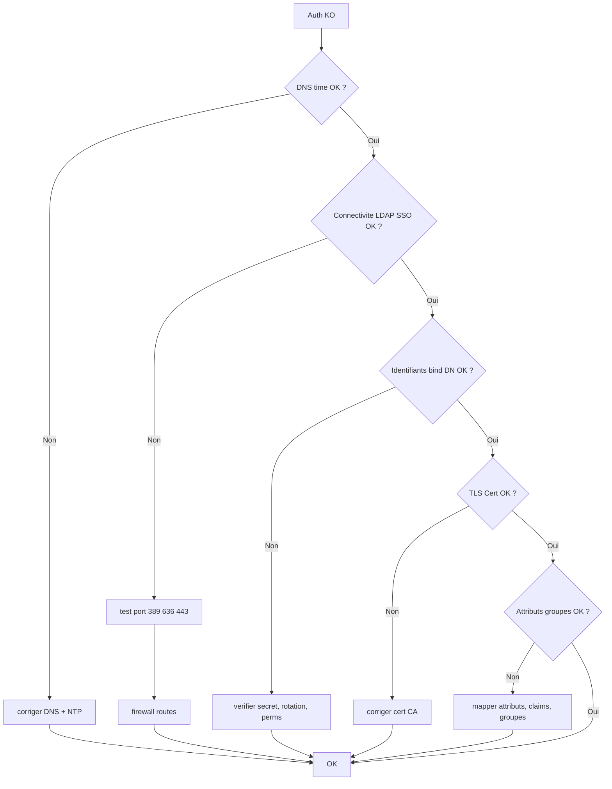

# Tree – Auth LDAP/SSO (échecs login, SSO cassé)

## Diagramme



## Tests rapides
Linux:
```bash
# TCP
nc -vz <ldap_host> 389
nc -vz <ldap_host> 636
# (si ldap-utils dispo)
ldapsearch -x -H ldap://<ldap_host> -D "<binddn>" -W -b "<base>"
```

Windows:
```powershell
Test-NetConnection <ldap_host> -Port 389
Test-NetConnection <ldap_host> -Port 636
```
