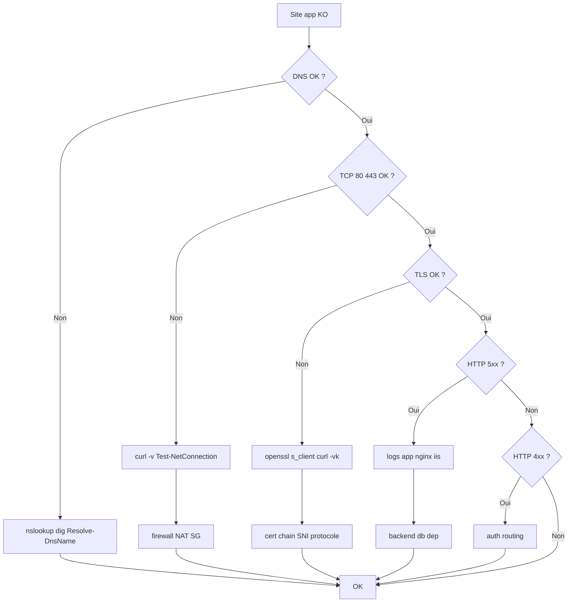

# Tree – HTTP/HTTPS inaccessible (client → service)



## Tests (Linux)
```bash
dig +short example.com
curl -vk https://example.com
openssl s_client -connect example.com:443 -servername example.com
```

## Tests (Windows)
```powershell
Resolve-DnsName example.com
Test-NetConnection example.com -Port 443
curl.exe -vk https://example.com
```
