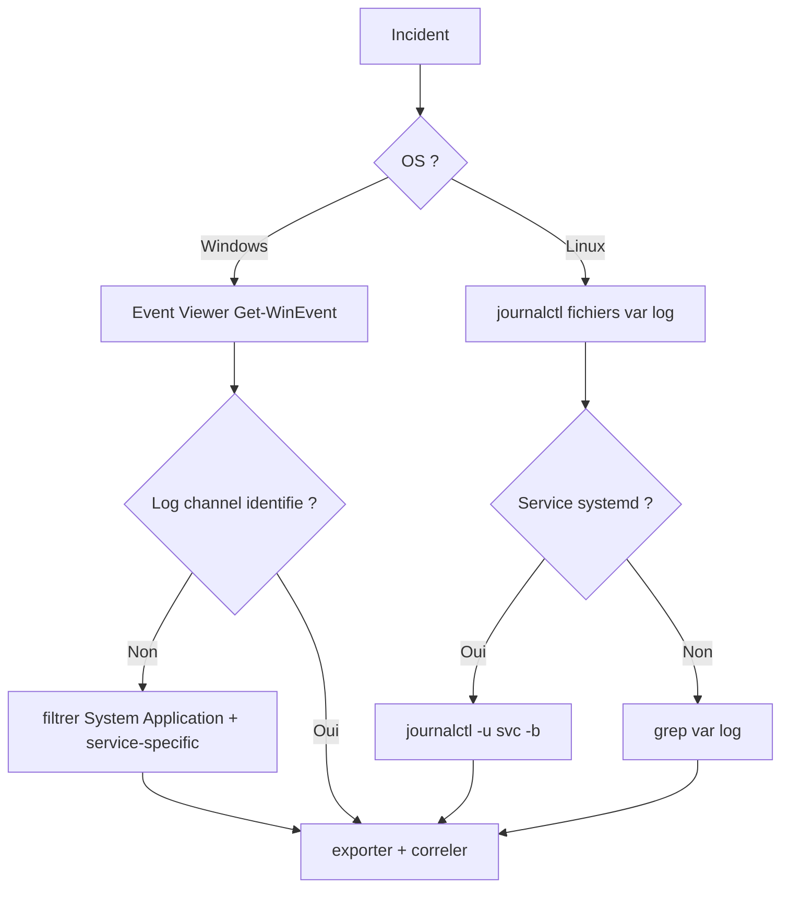

# Tree – Logs / Observability (on ne trouve rien / pas d'info)

## Objectif
Standardiser où chercher quoi, et quoi capturer.



## Windows (base)
```powershell
Get-WinEvent -LogName System -MaxEvents 50
Get-WinEvent -LogName Application -MaxEvents 50
# Ex: channel spécifique
Get-WinEvent -LogName "Microsoft-Windows-GroupPolicy/Operational" -MaxEvents 50
```

## Linux (base)
```bash
journalctl -b -n 200 --no-pager
journalctl -u <svc> -b -n 300 --no-pager
tail -n 200 /var/log/syslog 2>/dev/null || true
tail -n 200 /var/log/auth.log 2>/dev/null || true
```

## Preuves à capturer (minimum)
- timestamp + timezone
- commande + sortie
- ID événement / stacktrace
- versions (OS, service)
