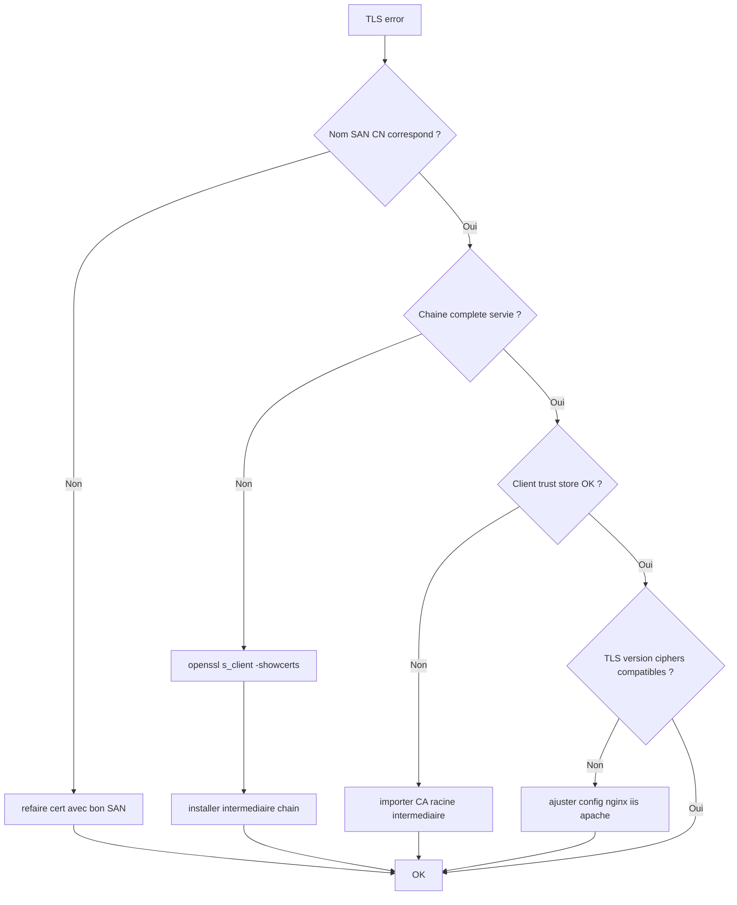

# Tree – TLS / Certificats (erreurs navigateur, handshake, chaîne)

## Symptômes
- “certificate verify failed”
- “unknown CA”
- “hostname mismatch”
- erreurs TLS après renouvellement



## Commandes
```bash
openssl s_client -connect host:443 -servername host -showcerts
curl -vk https://host
```
