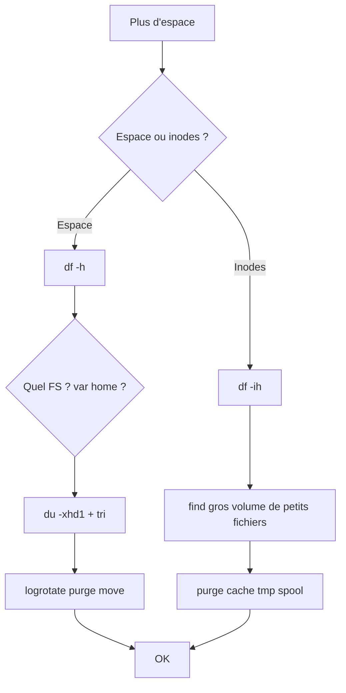

# Tree – Disk full / Inodes full



## Commandes
```bash
df -h
df -ih
sudo du -xhd1 /var | sort -h
sudo journalctl --disk-usage
sudo journalctl --vacuum-time=7d
sudo apt clean
sudo find /var/log -type f -name "*.gz" -size +100M -print
```
