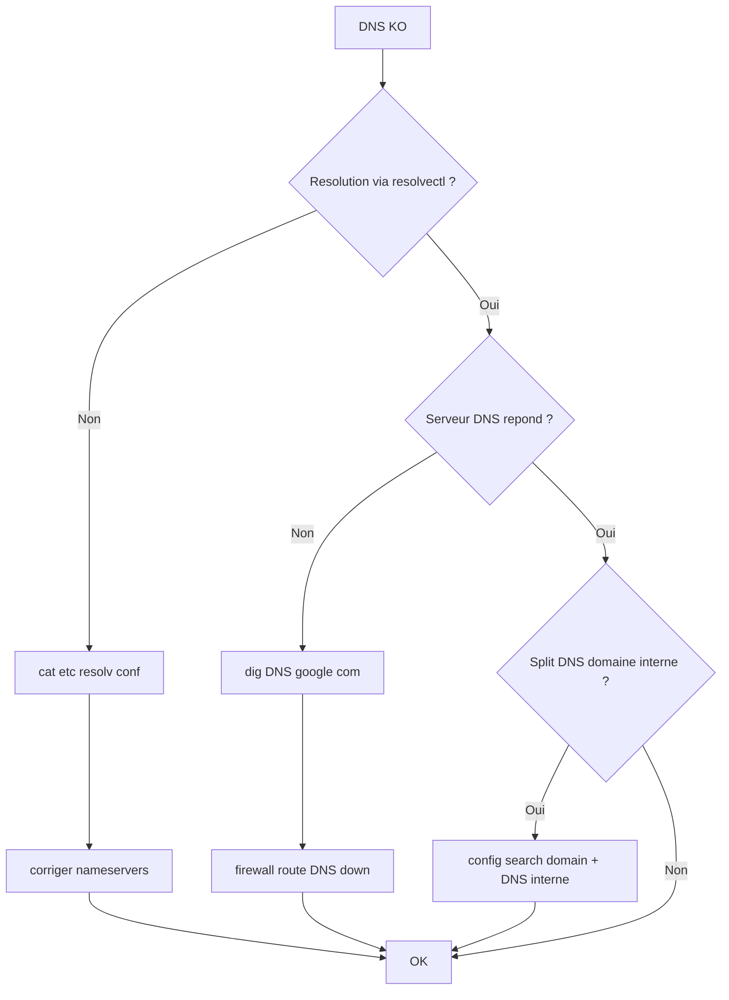

# Tree – DNS resolve Linux (dig/curl OK par IP mais pas par nom)



## Commandes
```bash
resolvectl status || true
cat /etc/resolv.conf
dig google.com
dig @1.1.1.1 google.com
getent hosts google.com
```
