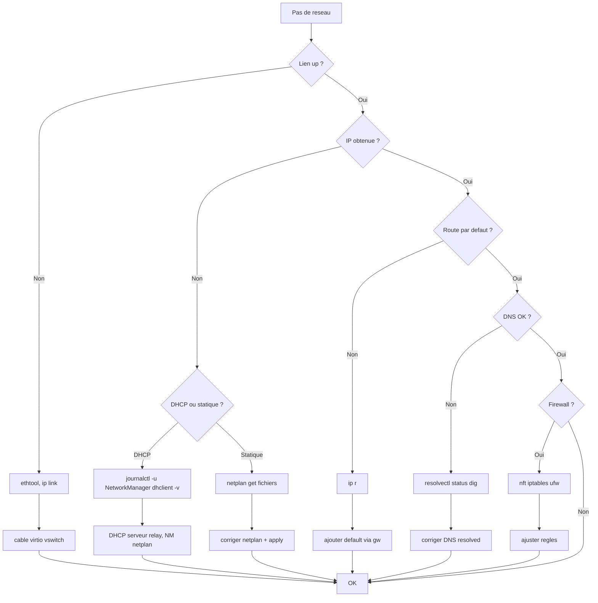

# Tree – Réseau Linux (pas d’IP / pas d’accès)



## Commandes
```bash
ip link
ip a
ip r
resolvectl status || cat /etc/resolv.conf
ping -c 2 1.1.1.1
ping -c 2 google.com
sudo journalctl -u NetworkManager -n 200 --no-pager
```

## Netplan (Ubuntu)
```bash
sudo netplan try
sudo netplan apply
```
