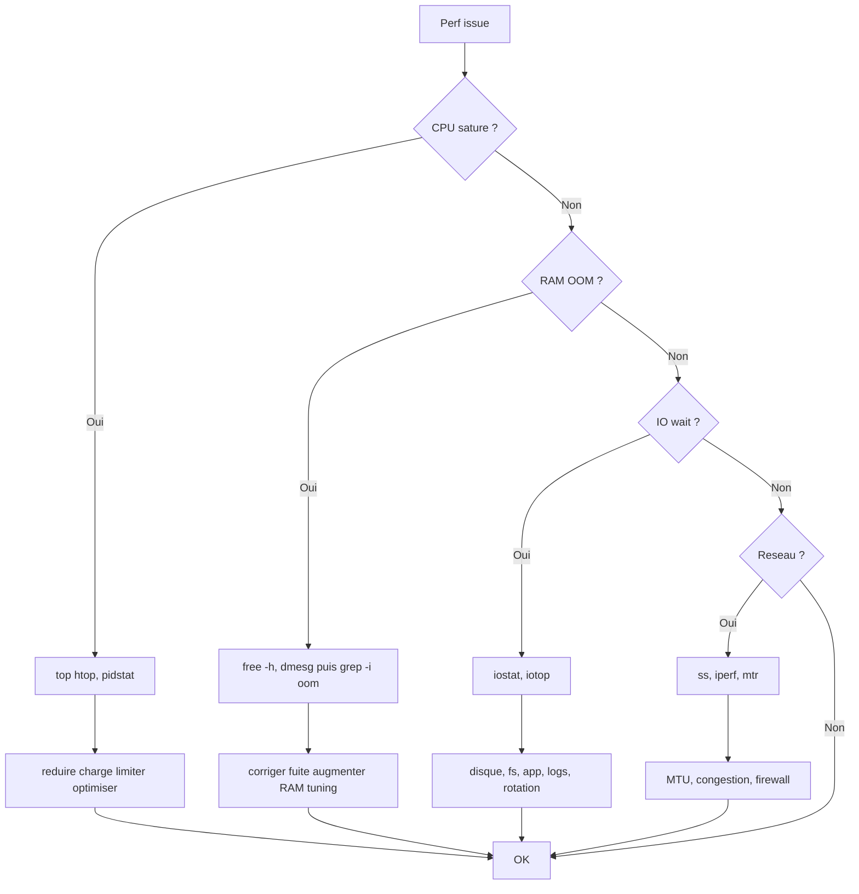

# Tree – Performance Linux (CPU / RAM / IO)

## Symptômes
- load average élevé
- latence applicative
- OOM / swap
- IO wait

## Diagramme



## Runbook (commandes)
```bash
uptime
top
vmstat 1 5
free -h
dmesg -T | grep -i oom || true
pidstat -u 1 5 || true
iostat -xz 1 5 || true
iotop -oPa || true
ss -s
```
