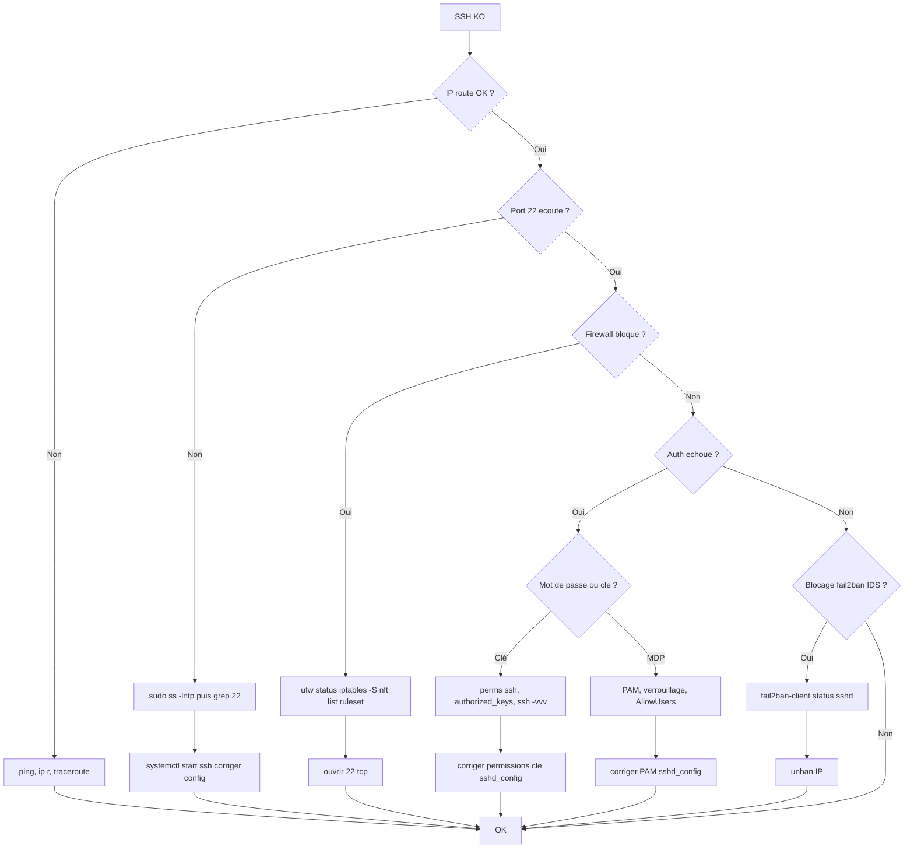

# Tree – SSH impossible

## Diagramme



## Runbook

### 1) Réseau
```bash
ping -c 2 <ip>
ip a
ip r
```

### 2) SSH daemon
```bash
sudo systemctl status ssh --no-pager
sudo ss -lntp | grep -E ':(22|2222)\b'
sudo sshd -t
```

### 3) Logs
```bash
sudo journalctl -u ssh -n 200 --no-pager
sudo tail -n 200 /var/log/auth.log
```

### 4) Debug côté client
```bash
ssh -vvv user@host
```

### 5) Permissions clés (classique)
```bash
chmod 700 ~/.ssh
chmod 600 ~/.ssh/authorized_keys
chmod 600 ~/.ssh/id_ed25519
```
