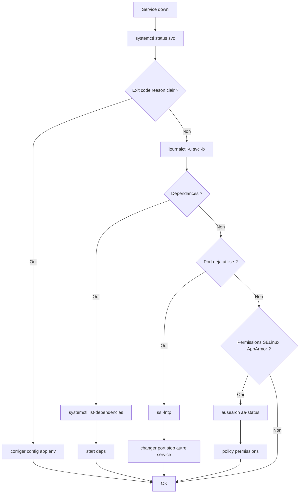

# Tree – systemd service failed



## Runbook
```bash
sudo systemctl status <svc> --no-pager
sudo journalctl -u <svc> -b -n 300 --no-pager
sudo systemctl cat <svc>
sudo systemctl show <svc> -p ExecStart -p Environment -p User -p Group
sudo ss -lntp
```
