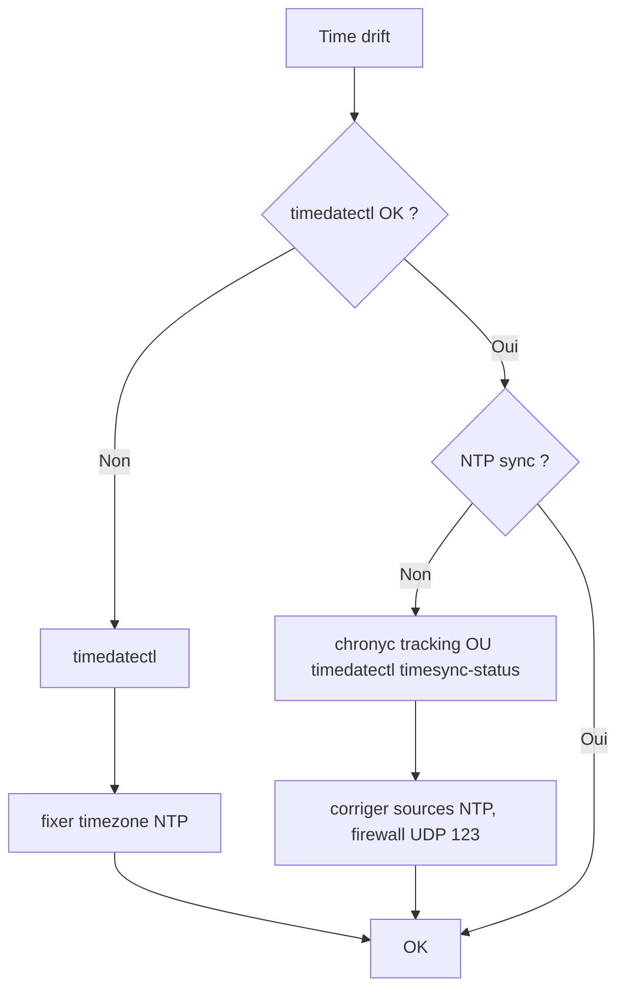

# Tree – Time / NTP Linux (Kerberos, TLS, logs incohérents)


```mermaid
flowchart TD
A[Time drift] --> B{timedatectl OK ?}
B -->|Non| C[timedatectl] --> D[fixer timezone NTP] --> Z
B -->|Oui| E{NTP sync ?}
E -->|Non| F[chronyc tracking OU timedatectl timesync-status] --> G[corriger sources NTP, firewall UDP 123] --> Z
E -->|Oui| Z[OK]
```

## Commandes
```bash
timedatectl
timedatectl timesync-status || true
chronyc tracking || true
chronyc sources -v || true
```
