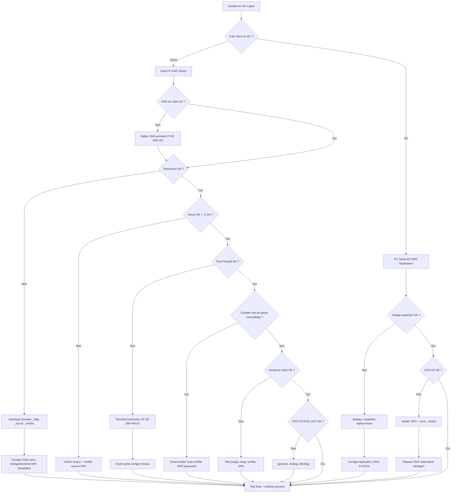

# Tree – AD Logon / Join Domain / Kerberos

## Symptômes
- “The trust relationship… failed”
- “There are currently no logon servers…”
- Join domain impossible
- Login lent / échec SSO

## Diagramme (Mermaid)



## Runbook (pas à pas)

### 1) Vérifs client (priorité)
✅ IP / gateway
```powershell
ipconfig /all
route print
```

✅ DNS doit pointer vers le(s) DC(s)
```powershell
Get-DnsClientServerAddress
nslookup domaine.local
nslookup -type=SRV _ldap._tcp.dc._msdcs.domaine.local
```

✅ Temps (Kerberos)
```powershell
w32tm /query /status
w32tm /resync
```

✅ Connectivité ports essentiels vers DC
- DNS 53
- Kerberos 88
- LDAP 389 (ou LDAPS 636 si utilisé)
- SMB 445 (SYSVOL / scripts)

```powershell
Test-NetConnection DC01 -Port 53
Test-NetConnection DC01 -Port 88
Test-NetConnection DC01 -Port 389
Test-NetConnection DC01 -Port 445
```

### 2) Côté DC – Santé AD
🧪 Diagnostics de base
```powershell
dcdiag /v
repadmin /replsummary
repadmin /showrepl
```

🧪 DNS AD – enregistrements SRV
```powershell
nslookup -type=SRV _ldap._tcp.dc._msdcs.domaine.local 127.0.0.1
```

### 3) Collecte de preuves (à mettre dans un ticket)
🧾
- `ipconfig /all` (client)
- `w32tm /query /status`
- résultats SRV `_ldap._tcp...`
- `dcdiag /v` + `repadmin /replsummary`
- Event Viewer (System, DNS Server, Directory Service)

## Corrections fréquentes (rapides)
🔧 Client DNS mal configuré → corriger DNS (ne pas utiliser 8.8.8.8 en DNS primaire sur un poste joint au domaine)
🔧 Décalage horaire → fixer NTP (PDC Emulator)
🔧 SRV manquants → redémarrer Netlogon sur DC et forcer réenregistrement DNS
```powershell
net stop netlogon
net start netlogon
ipconfig /registerdns
```
