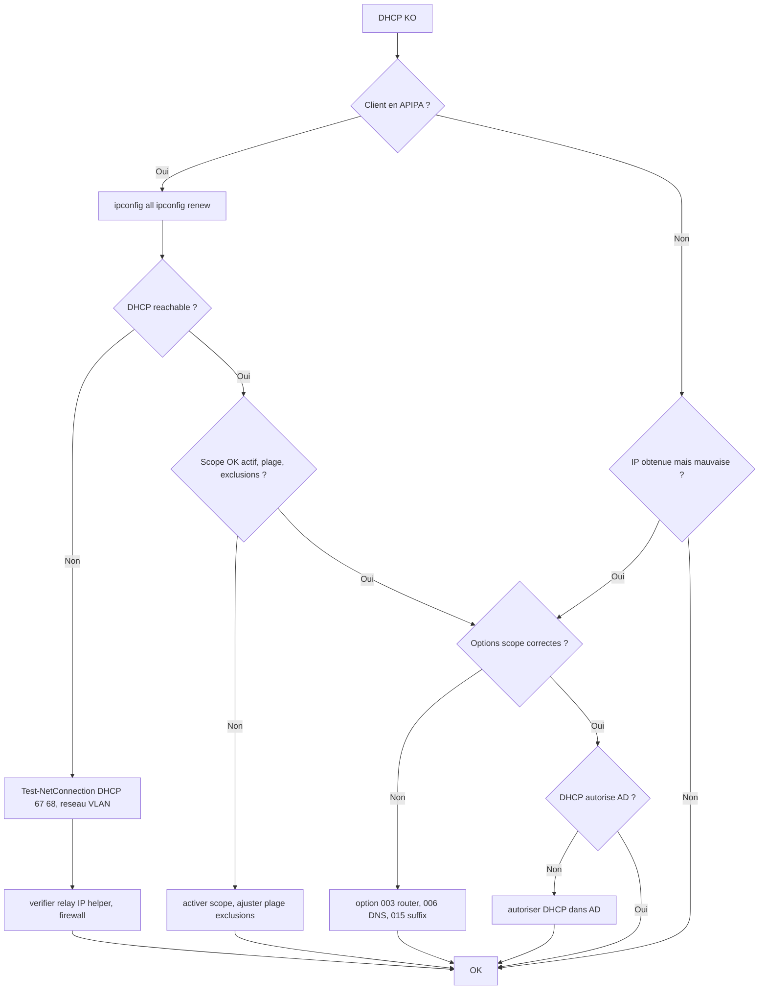

# Tree – DHCP Windows Server (pas de bail / mauvaise IP / options manquantes)

## Symptômes
- Clients en APIPA (169.254.x.x)
- Pas de bail, ou baux incohérents
- Mauvaises options (DNS, gateway)
- VLAN : DHCP ne traverse pas

## Diagramme



## Runbook (principaux checks)

### Client
```powershell
ipconfig /all
ipconfig /release
ipconfig /renew
```

### Serveur DHCP
```powershell
Get-Service dhcpserver
Get-DhcpServerv4Scope
Get-DhcpServerv4OptionValue
Get-DhcpServerv4Lease -ScopeId <x.x.x.x>
```

### VLAN / Relay
- Sur équipement réseau : vérifier IP helper / DHCP relay vers le serveur
- Vérifier que le firewall autorise UDP 67/68 (selon design)
