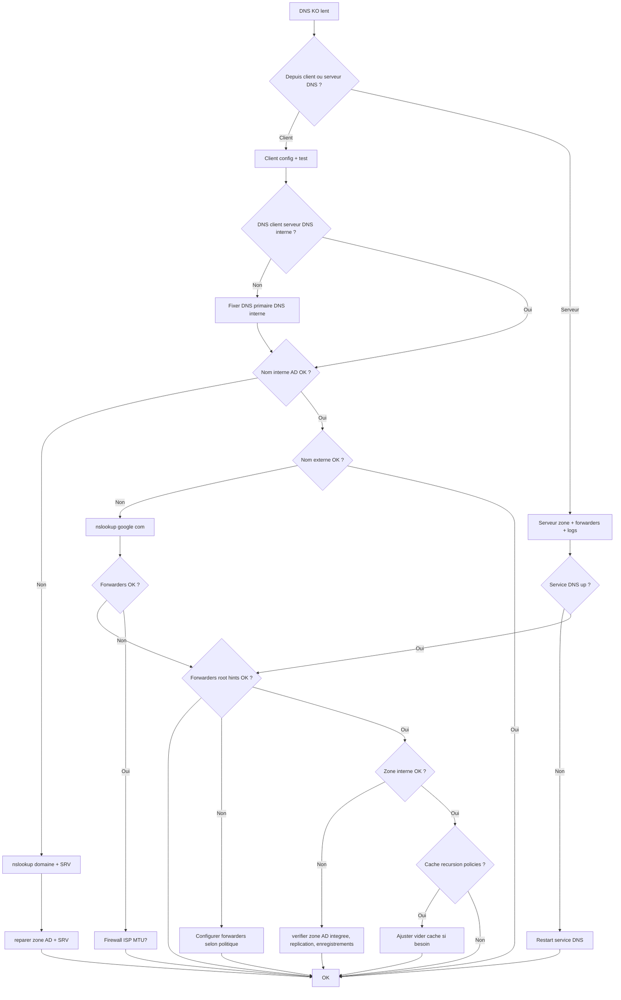

# Tree – DNS Windows Server (résolution KO / lente / NXDOMAIN)

## Diagramme



## Runbook

### Tests rapides (client)
```powershell
Get-DnsClientServerAddress
nslookup domaine.local
nslookup -type=SRV _ldap._tcp.dc._msdcs.domaine.local
nslookup google.com
```

### Tests rapides (serveur DNS)
```powershell
Get-Service DNS
Get-DnsServerForwarder
Get-DnsServerRecursion
Get-DnsServerZone
Get-DnsServerResourceRecord -ZoneName "domaine.local" -RRType SRV
```

### Actions correctives communes
🔧 Ajouter/valider forwarders
🔧 Vérifier la zone AD intégrée et sa réplication
🔧 Si SRV manquants : redémarrer Netlogon sur DC + registerdns
