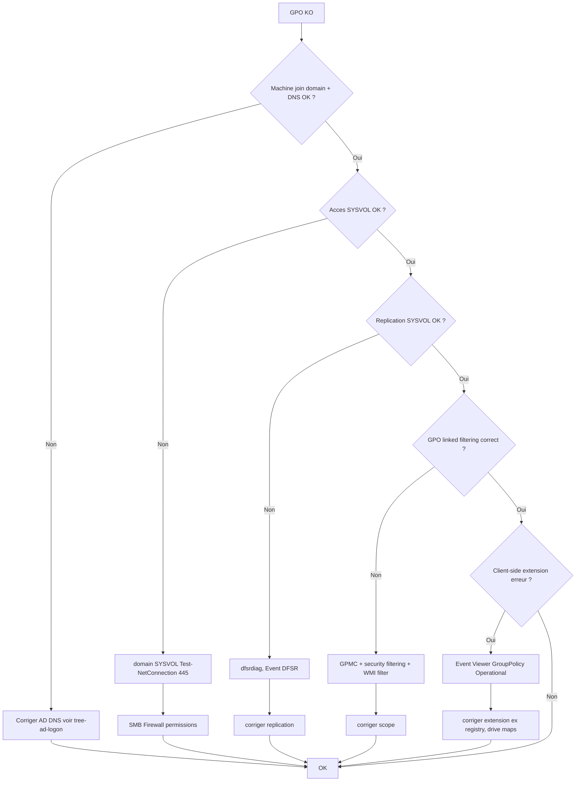

# Tree – GPO ne s'applique pas / lente / erreurs SYSVOL

## Symptômes
- Paramètres non appliqués (poste/serveur)
- `gpupdate /force` renvoie erreurs
- Scripts logon absents
- Lenteurs de login liées GPO

## Diagramme



## Runbook

### Côté client
```powershell
gpupdate /force
gpresult /h C:\Temp\gpresult.html
Get-WinEvent -LogName "Microsoft-Windows-GroupPolicy/Operational" -MaxEvents 50
```

### SYSVOL
```powershell
dir \\domaine.local\SYSVOL
Test-NetConnection DC01 -Port 445
```

### Côté DC (replication / DFSR)
```powershell
dcdiag /v
repadmin /replsummary
# selon version/config DFSR:
dfsrdiag ReplicationState
```
