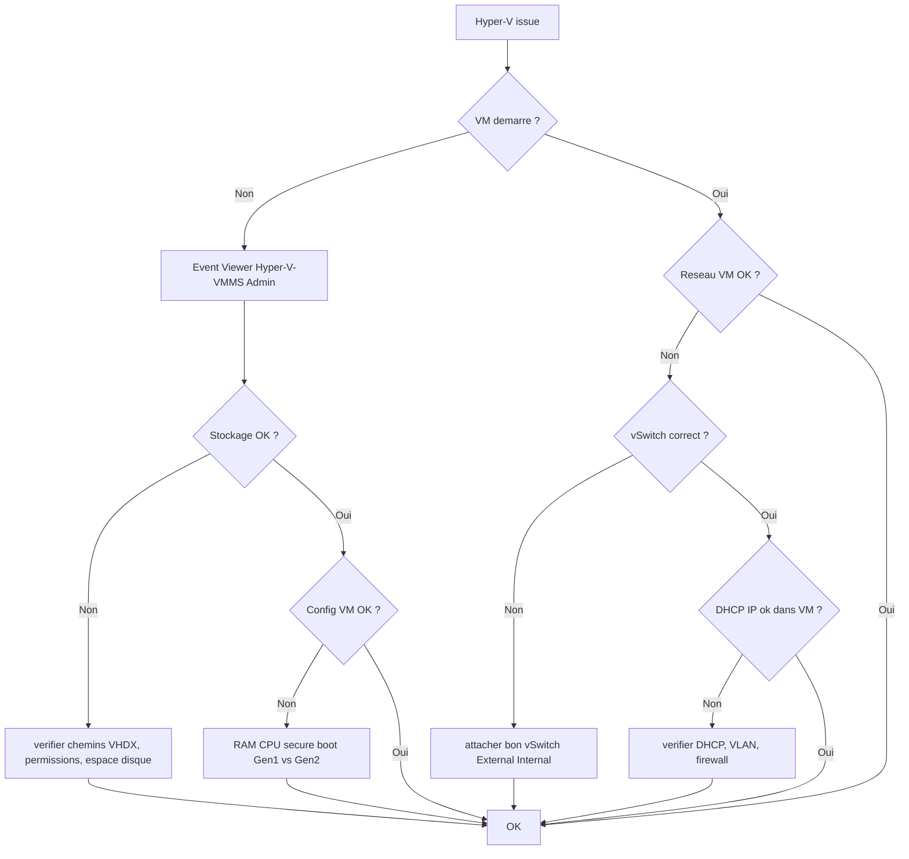

# Tree – Hyper-V (VM ne démarre pas / réseau VM KO)

## Symptômes
- VM stuck starting
- VM boot failure
- Pas de réseau dans la VM

## Diagramme

## Runbook
- Vérifier vSwitch (External/Internal/Private) et association NIC
- Vérifier VLAN ID si utilisé
- Logs : Hyper-V-VMMS, Hyper-V-Worker
