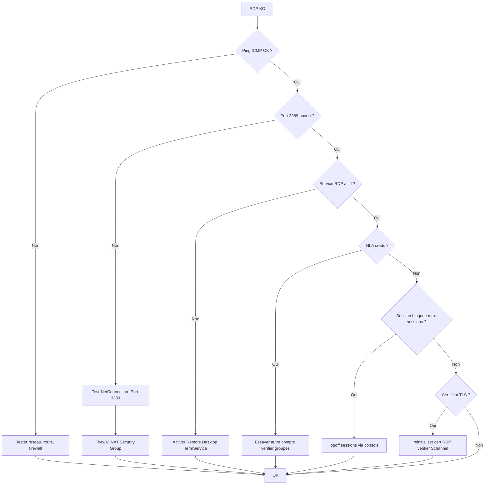

# Tree – RDP impossible (Windows Server)

## Diagramme



## Runbook
```powershell
Test-NetConnection SERVER -Port 3389
Get-Service TermService
netsh advfirewall firewall show rule name=all | Select-String -Pattern "Remote Desktop"
```

✅ Droits
- membre de **Remote Desktop Users** ou Administrateurs
- GPO : “Allow log on through Remote Desktop Services”

🧾 Logs
- Event Viewer → Microsoft-Windows-TerminalServices-LocalSessionManager/Operational
- Security (échecs login)
