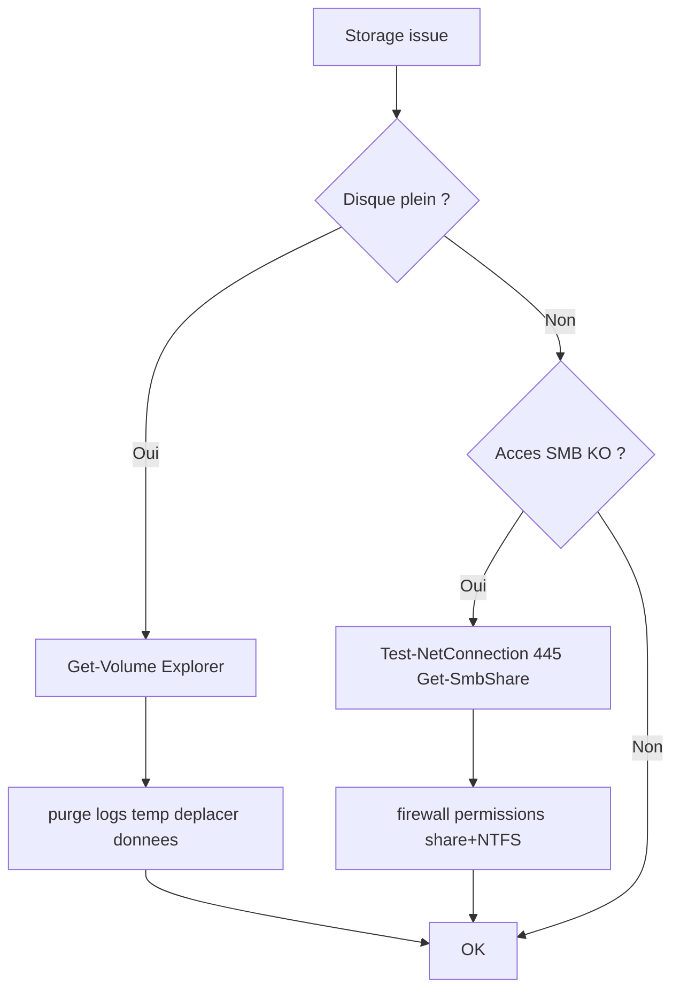

# Tree – Storage Windows (disque plein / accès SMB / permissions)

## Diagramme



## Commandes
```powershell
Get-Volume
Get-PSDrive -PSProvider FileSystem
Get-SmbShare
Get-SmbSession
Test-NetConnection <server> -Port 445
```

## Points clés
- Toujours vérifier **Share permissions** ET **NTFS permissions**
- SMB bloqué par firewall = symptôme fréquent
